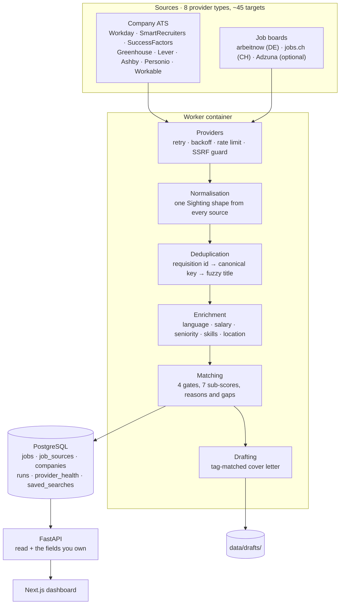
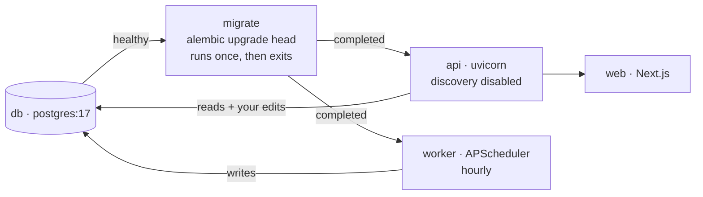
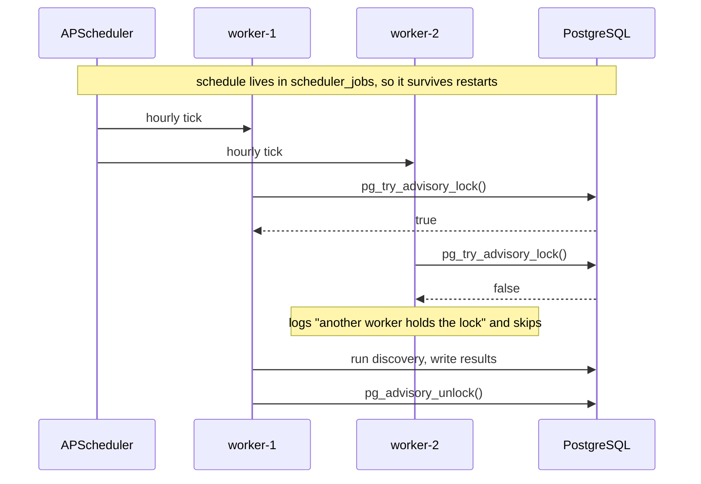
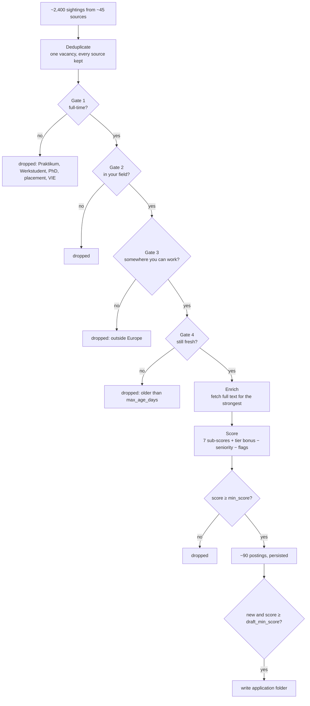

# Architecture

## The shape of it

## Services

`migrate` is a separate one-shot service on purpose. If the API applied
migrations itself, two replicas starting together would race into the same
schema change. Making it a dependency both `api` and `worker` wait on means
neither can meet a half-migrated database.

## Scheduling and mutual exclusion

`pg_try_advisory_lock` returns immediately rather than blocking, so the loser
skips its tick instead of queueing a duplicate sweep behind the winner. The
lock is tied to the connection, so a killed worker releases it automatically
and cannot wedge the schedule.

**Why not Redis or Celery.** The database already provides durable scheduling
(APScheduler's `SQLAlchemyJobStore`) and mutual exclusion (advisory locks).
Adding a broker would introduce a service to run, monitor and back up in
exchange for nothing this workload needs.

**Why not Qdrant.** Embeddings would catch paraphrased skills that literal
matching misses, but the scoring has to be explainable — "the posting contains
the word PyTorch" is a reason you can check in a second, and a cosine
similarity is not. Noted in the roadmap rather than shipped for its own sake.

## The pipeline, step by step

Seniority is deliberately **not** a gate. A senior role stays searchable and
takes a large score penalty, so it sinks without disappearing.

## The two invariants

Everything else is detail; these two are what the design protects.

**1. Run-owned and human-owned columns never overlap.**

| A run writes | Only you write |
| --- | --- |
| title, url, location, description | status, status history |
| posted_at, last_seen_at, is_open | notes, contact_person |
| score and every sub-score | starred, hidden |
| skills, domains, flags, language, salary | applied_at, follow_up_at, salary_discussion |

`_persist()` in `app/services/discovery.py` writes only the left column. This
is asserted directly by `TestRunsNeverOverwriteHumanFields` — a sweep can
refresh a score while your notes survive untouched.

**2. Three kinds of fact are kept apart.**

| What the employer said | What we observed | What we inferred |
| --- | --- | --- |
| `posted_at` | `first_seen_at` | `seniority` |
| `salary_*` with `basis=explicit` | `last_seen_at` | `language_requirement` |
| `description` | `removed_at`, `times_seen` | `skills`, `domains` |

No inference step writes the first column. Every inference carries evidence —
the fragment of the posting it came from — so it can be audited rather than
trusted. A salary that had to be annualised or converted is marked `≈` all the
way to the screen.

## Identity and deduplication

A vacancy is keyed by `company | normalised title | city`, never by URL. Most
ATS platforms mint a fresh URL whenever a posting is edited, so a URL key
announces the same job as new every time someone fixes a typo.

Three signals, cheapest first:

1. **Employer requisition id.** Decisive. Airbus renames postings without
   changing the id, so the stale URL slug would otherwise look like a new job.
2. **Canonical key.** Normalised company, title and city.
3. **Fuzzy title within an employer.** Jaccard overlap ≥ 0.72, for
   "ML Engineer" versus "Machine Learning Engineer (f/m/d)".

With one guard: **a provider's own ids are authoritative within that
provider.** If a source reports two postings under different ids, they are two
postings. Accenture advertises twenty-one separate Bengaluru requisitions all
titled "AI / ML Engineer" and returns no location for any of them — without
this rule they collapse into a single job.

## Provider capabilities

Sources differ in ways that are permanent configuration, not faults, and the
system records that difference instead of logging it hourly as an error.

| Capability | Meaning |
| --- | --- |
| `date_filter: server` | The source can filter by posting date itself |
| `date_filter: client` | It cannot; we page deeper and filter locally |
| `date_filter: none` | The source publishes no dates at all |
| `stale_dropped: N` | How many postings the age filter removed |

Workday is the clearest case. Its `startDate` facet is per-tenant
configuration: Airbus exposes it, while Roche, ABB, Thales, Novartis, Philips,
Logitech and Accenture do not, and no request variation makes it appear. The
provider reads the facet where offered and pages deeper where it is not.

## Failure isolation and health

Every provider call is wrapped by `run_provider()`, which converts any failure
into a reportable result rather than letting it end the run. Outcomes roll into
`provider_health`:

| State | When |
| --- | --- |
| `healthy` | answered |
| `degraded` | one or two consecutive failures — a timeout, a deploy, a blip |
| `failed` | three or more; backed off for `backoff_minutes` |
| `rate_limited` | answered 429; paused for 30 minutes |
| `skipped` | currently backed off |

Backoff is never permanent. Sites recover, and a source that is never retried
is a source silently lost.

## Security

| Concern | Measure |
| --- | --- |
| SSRF | `app/security.py` validates every URL before fetching: HTTPS only, DNS resolved, private/loopback/link-local/reserved ranges refused. Provider responses supply URLs, so they are untrusted input. |
| Stored XSS | Descriptions are third-party HTML. `clean_html` strips scripts, styles, iframes and event handlers at ingestion, and strips again after entity decoding so encoded markup cannot survive one pass. |
| Secrets in logs | `RedactingFilter` masks anything matching `api_key=`, `token=`, `password=` and similar before a record is emitted. |
| Runaway clients | Mutating endpoints are rate limited per client. |
| Container surface | Both images run as non-root with explicit healthchecks. The database port can be removed from compose to keep it inside the network. |
| Credentials | Never in the repository. `.env` and `config/profile.yml` are gitignored; committed examples carry placeholders. |

## Adding a source

1. Add a class to `app/providers/` implementing `fetch()`.
2. Register it in `app/providers/__init__.py`.
3. Reference it in `config/profile.yml`.

Nothing else changes. Which adapter an employer needs is visible in its
careers URL:

| URL contains | adapter | `arg` |
| --- | --- | --- |
| `*.myworkdayjobs.com` | `workday` | `tenant\|wdN\|SiteName` |
| `*.smartrecruiters.com` | `smartrecruiters` | company slug |
| `jobs.<company>.com` | `successfactors` | that hostname |
| `boards.greenhouse.io/<slug>` | `greenhouse` | the slug |
| `jobs.lever.co/<slug>` | `lever` | the slug |
| `jobs.ashbyhq.com/<slug>` | `ashby` | the slug |
| `<slug>.jobs.personio.de` | `personio` | the slug |
| `apply.workable.com/<slug>` | `workable` | the slug |

## What is deliberately not automated

Ferrari, Lamborghini, Audi, Porsche, Volkswagen, Mercedes-Benz, Emirates,
Siemens, ZEISS, Infineon, Allianz, Munich Re, NVIDIA and Lufthansa render
their listings with JavaScript and publish no open endpoint. All were probed
directly on 21 September 2026.

They are kept as watchlist entries with a one-click link rather than dropped,
because a silently missing employer looks exactly like an employer with no
vacancies.

LinkedIn and Indeed are absent by choice: both block automated access, and
LinkedIn automation risks a permanent account ban.

**Applications are never submitted.** The system prepares — a tailored draft,
the saved advertisement, a checklist — and stops. The last step is always a
human.
